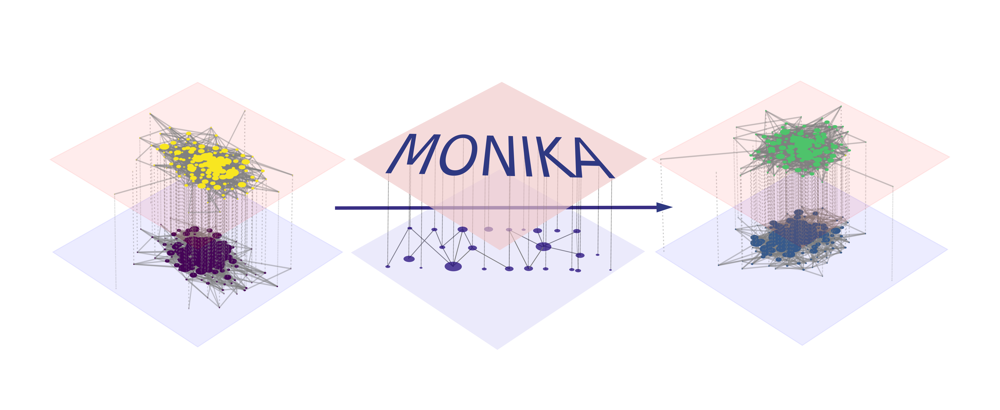
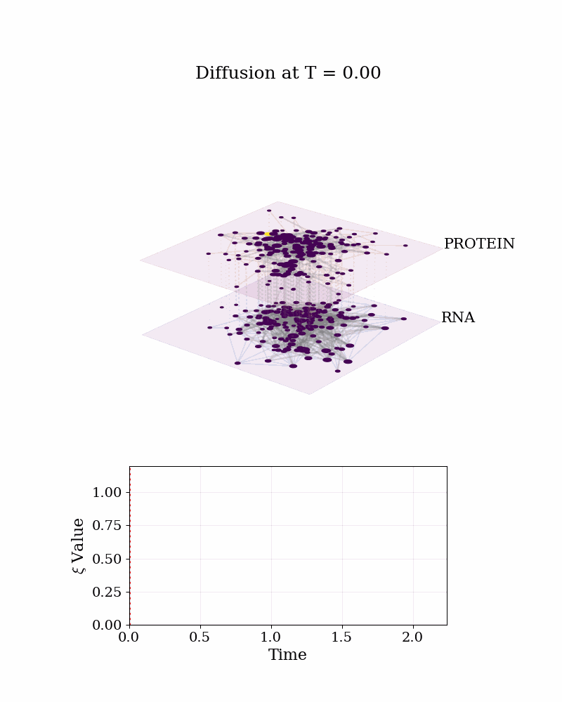

# MONIKA
## Multi-Omic Network Inference &amp; Knockout Analysis

This tool performs both network inference and integration in a multi-omic setting. Following single layer inference via a prior-incorporating Gaussian Graphical Model, multiple layers are inferred via Bayesian sequential updating. 
Target nodes and biological pathways are identified via significance testing of knockouts and diffusion analysis.

The tool has been tested on colorectal cancer datasets.

## Installation
To make installation easy, it is recommended to use a conda environment. In the directory, simply run 

edit the environment.yml file, change prefix to where you want to install the environment (prefix: path/to/anaconda3/envs/monika)

conda env create -f environment.yml

conda activate monika

pip install pymnet==0.2.0

## Data
The multi-omic CRC data used for testing is included in the repository. It is sourced from: https://www.linkedomics.org/data_download/TCGA-COADREAD/. It contains patient-coupled samples for both transcriptomics, proteomics and RPPA (Reverse-Phase Protein Array).

## Full Pipeline Run
Run the scripts in the following order, with default parameter settings, to infer networks and determine critical genes via diffusion analysis.

### omics_data_processing.py
- Matches protein and RNA data
- Winsorizes outliers
- Checks for normality of variables and transforms them

### network_inference.py
- Executes piglasso.py for generating edge count distributions
- Infers omics networks from edge counts (RNA + protein)
	- See "Running on HPC" below to run this step in under 10 minutes

*Results in results/net_results: Gives info on the inferred omics network layers*

### network_diffusion.py
- Performs knockout analysis 

Results in results/diff_results: 
- NODE_KNOCKOUTS_RESULTS_symmetricTrue_low_dens.csv is a spreadsheet containing results on the effect of knockouts on the network, as well as investigating potential increases in similarity between cms123 and cmsALL

## Running on HPC
The most time-consuming step by far is network_inference.py. 
If you want to infer the network within minutes, rather than several hours, just upload the MONIKA folder to your HPC environment (NOTE: upload the folder AFTER running omics_data_processing.py but BEFORE running network_inference.py. This ensures that the processed data is on the cluster). 

Once in the cluster, you'll want to create a conda environment here too. If you have an account at SURF, it becomes even simpler:

create the conda environment with:

conda create --name monika python=3.9 numpy networkx tqdm pyparsing rpy2 -c conda-forge

The scripts to run on HPC are already in the folder src/hpc_scripts. To get the edge counts from piglasso.py, just execute the job script called runpig.sh. The results from this are stored in results/net_results. Just send them back to the same location (MONIKA/results/net_results) on your local machine. Once you have the files, run network_inference.py to continue the pipeline.

Transferring files back, example: scp -r user@snellius.surf.nl:MONIKA/results/net_results path/to/local/MONIKA/results/

Note: You will have to adjust some file paths in the runpig.sh job script.
